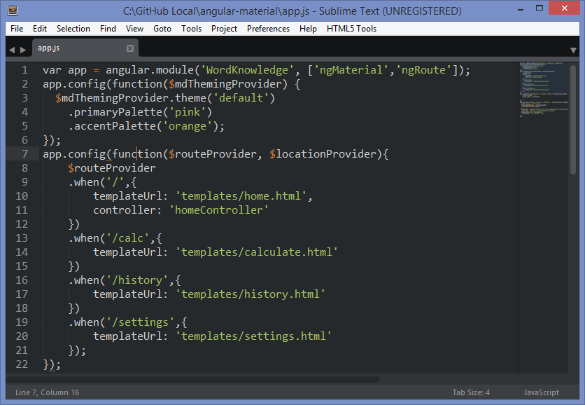
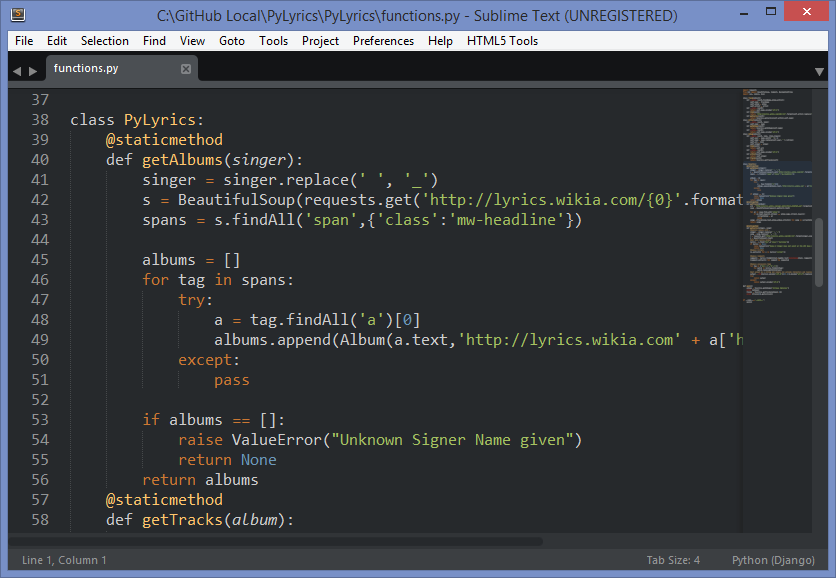

##Dusk Color Scheme for Sublime Text 2/3 

This is a color scheme for Sublime Text 2 and 3 that is meant to be used with the Flatland Theme. This color scheme emphasises on the color brown and most snippets are highlighted in various shades of brown while maintaining a background compatible with Flatland.

It is recommended to use the Flatland Theme along with this Color Scheme in Sublime Text.

###Installation

####Package Control

To install through Package Control, open the command pallete and select Package Control. Search for Dusk in the repository list and press enter.

####Via git

`git clone` this repo and copy the Dusk.tmTheme file into your packages directory (User) to install via git

###Activating the Color Scheme

For activating, click on Preferences -> Color Scheme -> Dusk -> Dusk. If you've installed using git then click on Preferences -> Color Scheme -> User -> Dusk.

###About

Created by Pradipta aka geekpradd. Copyright 2015. MIT Licensed.